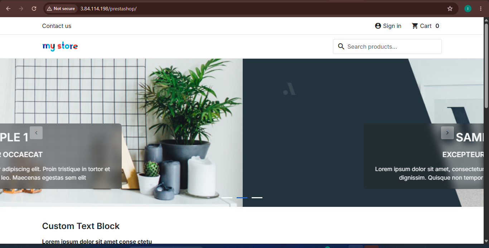
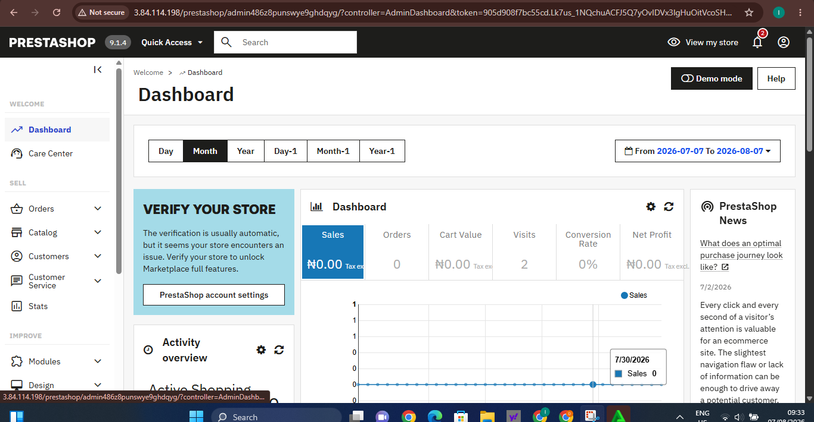
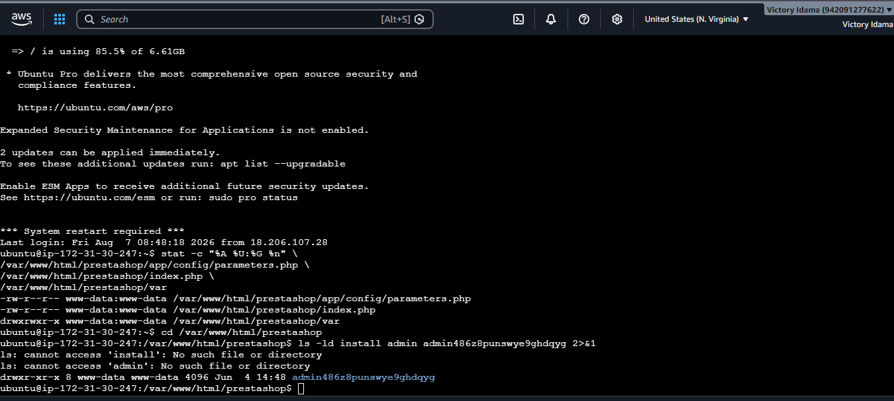
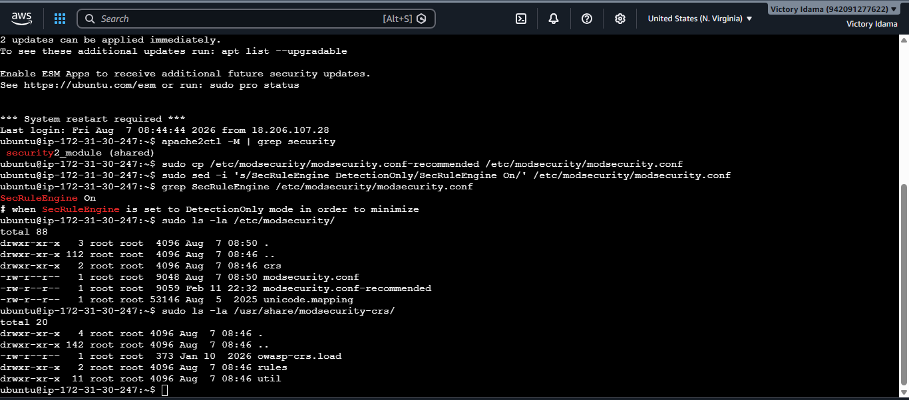
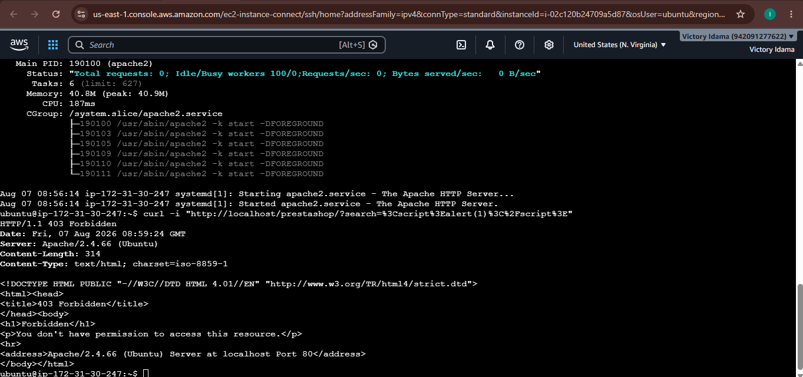
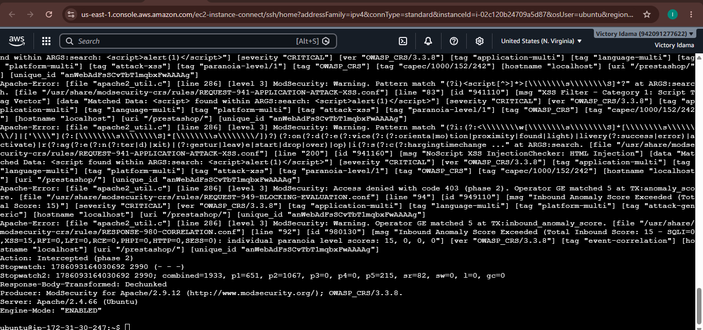
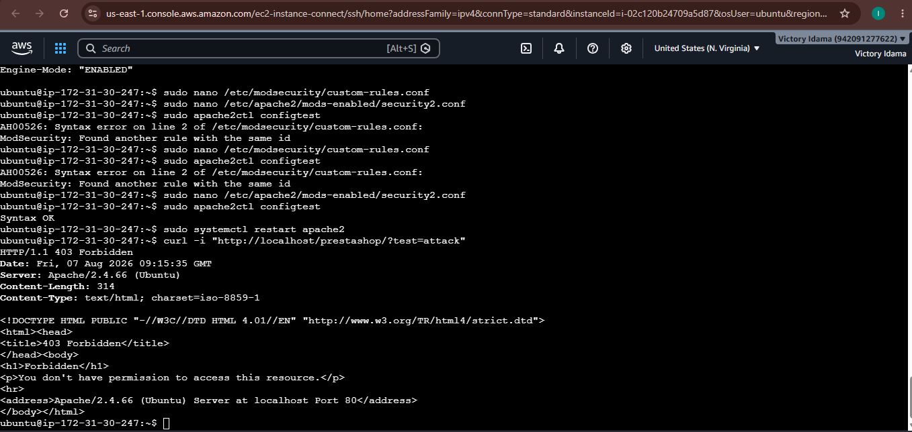
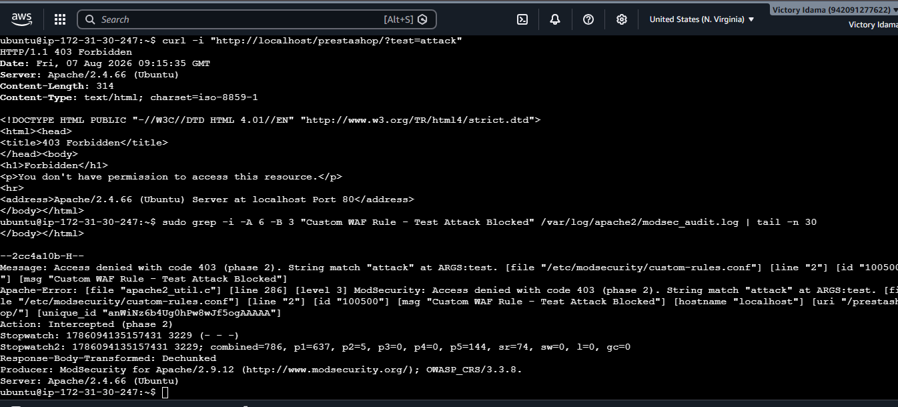

# PrestaShop Web Application Firewall (WAF) Security Lab

## Project Overview

In this project, I deployed a PrestaShop e-commerce application on
an AWS EC2 Ubuntu server and implemented ModSecurity with the
OWASP Core Rule Set (CRS) to provide Web Application Firewall
protection.

The objective was to deploy the application, apply basic security
hardening, configure a WAF, simulate an XSS attack, analyze the
security logs, and create a custom WAF rule.

## Technologies Used

- AWS EC2
- Ubuntu
- Apache
- MySQL
- PHP
- PrestaShop
- ModSecurity
- OWASP Core Rule Set (CRS)

---

## 1. PrestaShop Deployment

I successfully deployed PrestaShop on an AWS EC2 Ubuntu server
using Apache, PHP, and MySQL.

I verified that the public-facing e-commerce store was accessible
from the browser.

**Figure 1: PrestaShop front office successfully running on AWS EC2.**

    

---

## 2. PrestaShop Back Office

I accessed the PrestaShop administrative dashboard to confirm
that the back office was working correctly.

**Figure 2: PrestaShop back-office dashboard successfully accessed.**

    

---

## 3. PrestaShop Security Hardening

I performed basic security hardening after installation.

This included:

- Removing the `/install` directory.
- Renaming the default `/admin` directory.
- Checking important file and directory permissions.
- Confirming ownership by the Apache web server user.

**Figure 3: PrestaShop hardening validation showing removal of the
installation directory, renamed admin directory, and verified file
permissions.**

    

---

## 4. ModSecurity and OWASP CRS Configuration

I installed and enabled ModSecurity on the Apache web server.

I confirmed that the `security2_module` was loaded and configured
the ModSecurity rule engine in blocking mode.

The OWASP Core Rule Set (CRS) was also enabled to provide
protection against common web application attacks.

**Figure 4: ModSecurity enabled on Apache with SecRuleEngine set
to On and OWASP Core Rule Set installed.**

    

---

## 5. XSS Attack Simulation

To test the WAF, I sent a controlled Cross-Site Scripting (XSS)
payload to the PrestaShop application from within my lab
environment.

ModSecurity intercepted the request and returned:

HTTP/1.1 403 Forbidden

This demonstrated that the malicious request was blocked before
it could reach the application.

**Figure 5: Simulated XSS request blocked by ModSecurity with
HTTP 403 Forbidden.**

    

---

## 6. XSS Detection in WAF Logs

I examined the ModSecurity audit log to determine why the
request was blocked.

The OWASP CRS detected the XSS payload and generated security
events identifying the request as an XSS attack.

The logs showed:

- XSS detection
- OWASP CRS rule IDs
- Critical severity
- Anomaly score
- HTTP 403 response
- Request interception

**Figure 6: ModSecurity audit log showing OWASP CRS detecting and
intercepting the simulated XSS attack.**

    

---

## 7. Custom WAF Rule

In addition to the OWASP Core Rule Set, I created a custom
ModSecurity rule.

The rule was designed to detect the word `attack` in the `test`
request parameter and deny matching requests with HTTP status 403.

This demonstrated how custom security controls can be added to
ModSecurity based on application requirements.

---

## 8. Custom WAF Rule Testing

I tested the custom rule by sending a request containing the
configured test value.

The request was successfully blocked with:

HTTP/1.1 403 Forbidden

**Figure 7: Custom ModSecurity WAF rule successfully blocking a
test request with HTTP 403 Forbidden.**

    

---

## 9. Custom Rule Log Validation

Finally, I examined the ModSecurity audit log to confirm that
the request was blocked specifically by my custom rule.

The log identified:

- Custom rule ID `100500`
- Matching request parameter
- HTTP 403 response
- "Custom WAF Rule - Test Attack Blocked"
- Request intercepted during phase 2

**Figure 8: ModSecurity audit log confirming that custom rule ID
100500 detected and blocked the test request.**

    

---

## Security Controls Implemented

- PrestaShop installation hardening
- Administrative directory renaming
- File and directory permission validation
- ModSecurity Web Application Firewall
- OWASP Core Rule Set
- XSS attack detection and prevention
- WAF security logging
- Custom ModSecurity rule
- HTTP 403 blocking

## Key Takeaways

This project gave me hands-on experience deploying and securing
a web application in AWS.

I learned how to configure a Web Application Firewall, simulate
a controlled web attack, investigate WAF logs, and create custom
security rules to protect a web application.

## Disclaimer

All security testing in this project was performed in my own
controlled lab environment for educational purposes.
